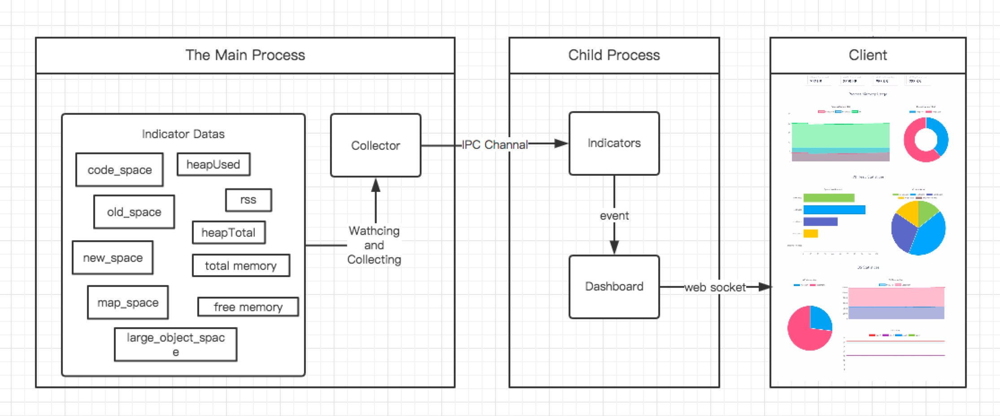

# NodeJS 内存监控工具

### Memeye
&#8194;&#8194;&#8194;&#8194;Memeye 是一个轻量级的 NodeJS 进程监控工具，它提供 进程内存、V8 堆空间内存、操作系统内存 三大维度的数据可视化展示。
前端部分，借助 Vue2 和 ChartJS 提供了一个不错的动态展示面板。

&#8194;&#8194;&#8194;&#8194;Memeye 在宿主进程中，只植入了一个简单的数据收集器，其他工作则启动一个子进程，交由子进程来进行。

&#8194;&#8194;&#8194;&#8194;这样做能把 Memeye 的代码对宿主进程的影响降到最低，以确保数据的真实性   
### 特点
- 轻量级
- 简单
- 面向开发环境
- 可视化

&#8194;&#8194;&#8194;&#8194;注意: Memeye 暂时只支持单进程，NodeJS 分布式进程还不适用，所以不建议在产品环境使用。

### 兼容性
- Node v7.x
- Node v6.x

### 安装 & 使用
&#8194;&#8194;&#8194;&#8194;运行下面命令安装：
```
    npm install -g memeye
```
&#8194;&#8194;&#8194;&#8194;然后在你的代码中引入
```
    const memeye = require('memeye');
    memeye();
```
&#8194;&#8194;&#8194;&#8194;最后打开你的浏览器，输入下面地址：
```
    http://localhost:23333  //23333 port by defaul.
```

### Memeye 是如何工作的
&#8194;&#8194;&#8194;&#8194;Memeye 有三个核心概念：Collector, Indicators, Dashboard。

&#8194;&#8194;&#8194;&#8194;Collector 运行在宿主进程中（你的NodeJS进程），Indicator 和 Dashboard 运行在子进程中，这样可以尽量减少 Memeye 代码对你的宿主进程的影响。
#### Collector
&#8194;&#8194;&#8194;&#8194;Collector 会监听宿主进程，并且收集数据，然后通过 IPC 通信管道发送数据给子进程，交由子进程处理。
#### Indicator
&#8194;&#8194;&#8194;&#8194;Indicator 像一个状态机。当它的属性变化的时候，会触发相应事件。所以我们可以用它来处理收集回来的数据。
#### Dashboard
&#8194;&#8194;&#8194;&#8194;Dashboard 会以子进程的形式唤起。他会创建一个 Indicator 实例，以及启动一个集成 socket.io 的 Http 服务器。

&#8194;&#8194;&#8194;&#8194;然后绑定 Indicator 和进程通信管道，以接收父进程发过来的数据。

&#8194;&#8194;&#8194;&#8194;最后再绑定 Indicator 和 socket.io，这样可以在 Indicator 属性变化的时候发送数据给前端。


