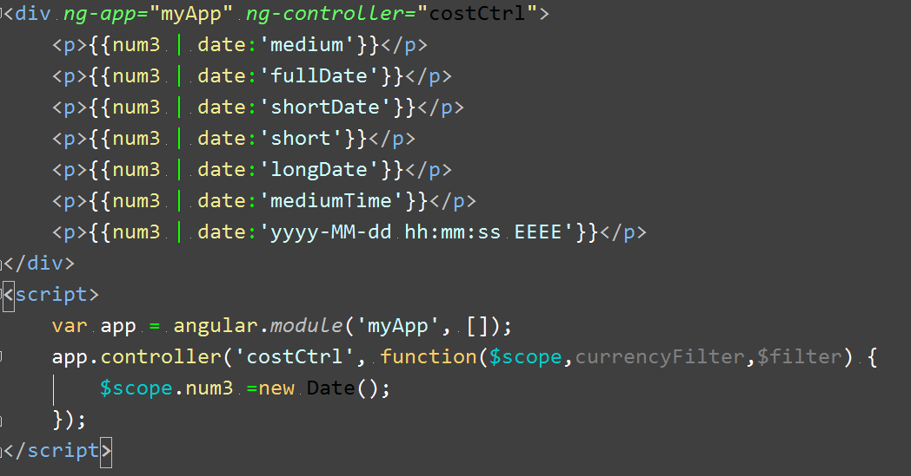
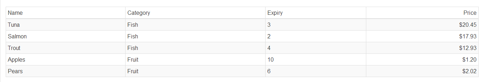

# 过滤器
## 1. AngularJS 过滤器   
过滤器将数据在被指令处理并显示到视图中之前进行转换，而不必修改作用域中原有的数据，这样能够允许一份数据在应用中的不同部分以不同形式得以展示。AngularJS内置了一些过滤器，它们是：currency(货币)、date(日期)、filter(子串匹配)、json(格式化json对象)、limitTo(限制个数)、lowercase(小写)、uppercase(大写)、number(数字)、orderBy(排序)。总共九种。除此之外还可以自定义过滤器，这个就强大了，可以满足任何要求的数据处理。   
## 2. 过滤器的两种使用方法   
### 2.1 在模板中使用   
```
我们可以直接在 {{}} 中使用filter，跟在表达式后面用 | 分割。
```
例如下面这个货币过滤器：   
   
结果为：   
   
### 2.2 在controller和service中使用   
我们的js代码中也可以使用过滤器，方式就是我们熟悉的依赖注入，例如我要在controller中使用currency过滤器，只需将它注入到该controller中即可，代码如下：   
  
输出结果为：   
   
## 3. 内置过滤器   
在这里我们简单介绍几种相对实用一点的内置过滤器。   
### 3.1 currency (货币处理)   
使用currency可以将数字格式化为货币，默认是美元符号，你可以自己传入所需的符号，例如传入人民币：

```
{{num | currency : '￥'}}
```
### 3.2 date (日期格式化)   
date过滤器基本可以满足一般的格式化要求。用法如下：

   
输出结果：    
    

参数用来指定所要的格式，y M d h m s E 分别表示 年 月 日 时 分 秒 星期，你可以自由组合它们。也可以使用不同的个数来限制格式化的位数。另外参数也可以使用特定的描述性字符串，例如“shortTime”将会把时间格式为 12:05 pm这样的。   
### 3.3 limitTo(限制数组长度或字符串长度)   
limitTo过滤器用来截取数组或字符串，接收一个参数用来指定截取的长度。   
```
{{ childrenArray | limitTo : 2 }}  //将会显示数组中的前两项
```
### 3.4 orderBy(排序)   
orderBy过滤器可以将一个数组中的元素进行排序，接收一个参数来指定排序规则，参数可以是一个字符串，表示以该属性名称进行排序。可以是一个函数，定义排序属性。还可以是一个数组，表示依次按数组中的属性值进行排序（若按第一项比较的值相等，再按第二项比较）,例如：   
    
输出：   
    
## 4. 链式过滤器   
过滤器最优秀的特性之一就是可以将过滤器串联起来使用，创造出更复杂的效果，下面的例子里我们使用链式调用将limitTo和orderBy链接使用的：   

  

输出结果：   
  
## 3.4 自定义过滤器   
filter的自定义方式也很简单，使用module的filter方法，返回一个函数，该函数接收输入值，并返回处理后的结果。   
比如我需要一个过滤器，它可以返回一个数组中奇数位的元素，代码如下：   
  
输出结果：   
  

[demo](http://localhost:4000/郭乃豪/郭乃豪-2017.03.03/Listing.html)
